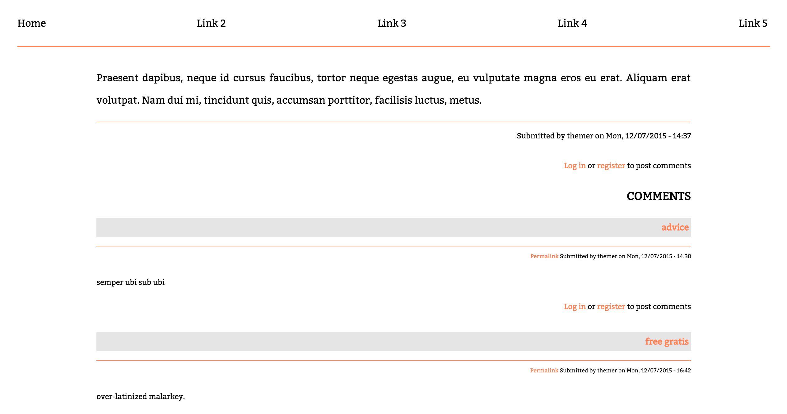

# Initial
> #### *A not-quite single-page Drupal 7 theme.*

*Initial* began as a way to understand Drupal theming by minimizing what was output by the theme's templates. This approach was inspired by and drew heavily on [this now defunct](http://web.archive.org/web/20130203055201/http://jamesbillings.me/labs/item/drupal-template-minimizing) article by James Billings.

* * *

* * *

### Usage

* * *

###### Navigation
  The `.info` file defines a region for site navigation links (`regions [nav_tabs] = Navigation Tabs`). Create a block and place it in the `Navigation Tabs` region.

  The markup for the navigation links should be placed in the body of the block. To make use of the **idTabs** jQuery plugin included with the theme, wrap the links in `
`.
